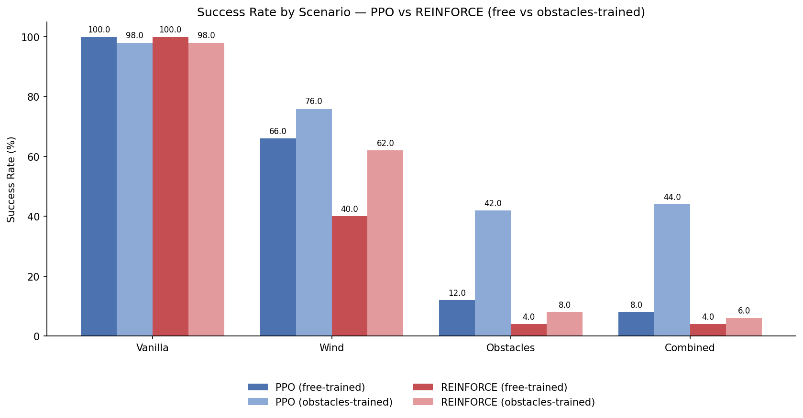
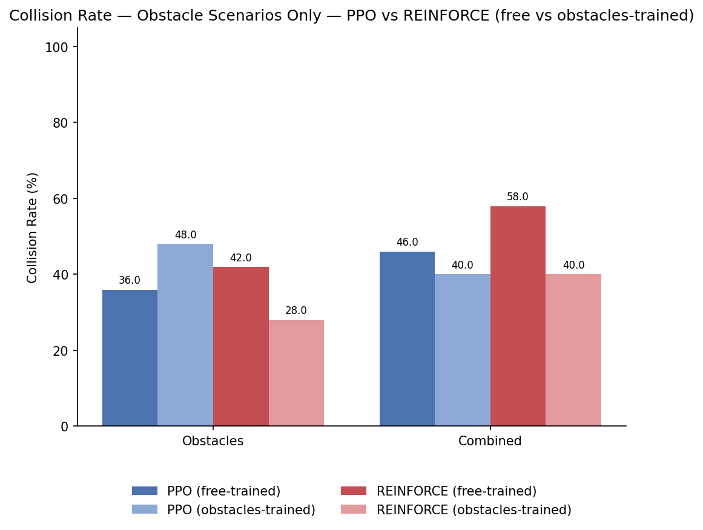
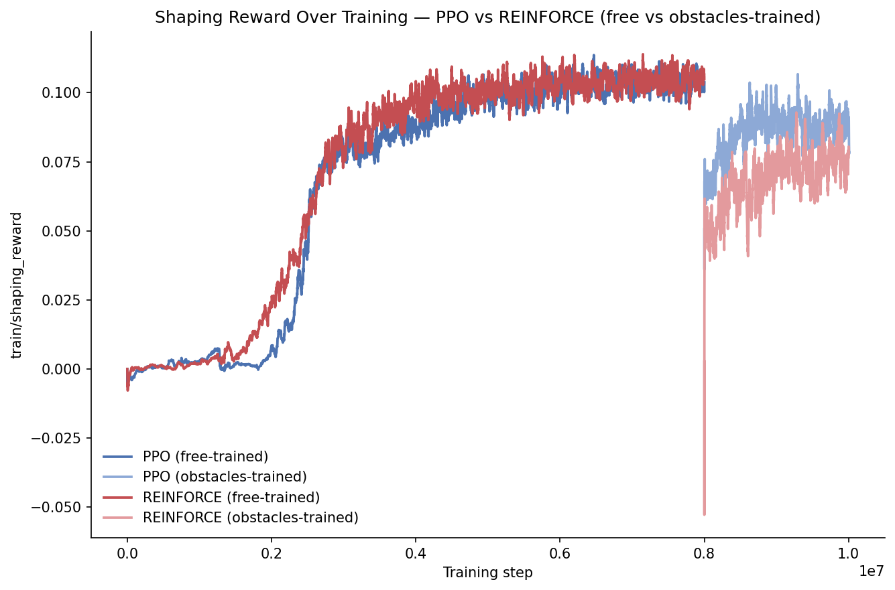
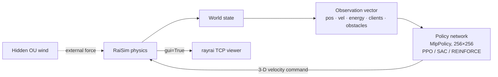
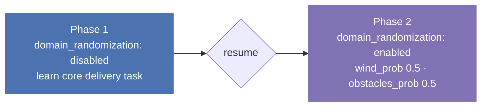

<div align="center">

# Drone Delivery Autonomous (Reinforcement learning)


**Comparing PPO, SAC, and REINFORCE on a simulated quadrotor that delivers packages to multiple clients — managing a battery budget, rejecting hidden wind, and dodging sphere obstacles.**

[](https://www.python.org/)
[](https://pytorch.org/)
[](https://github.com/DLR-RM/stable-baselines3)
[](https://raisim.com/)
[](https://wandb.ai/)
[](LICENSE)

</div>

<p align="center">
  
</p>
<sub>One episode : wind and obstacles forced on (`--force-obstacles 4`), captured live from the RaiSim viewer.</sub>


---

## 📑 Table of Contents

- [✨ Highlights](#-highlights)
- [📊 Results at a glance](#-results-at-a-glance)
- [🧩 The Physical Challenges](#-the-physical-challenges)
- [🏗️ How it works](#️-how-it-works)
  - [Two-phase domain-randomization training](#two-phase-domain-randomization-training)
- [⚡ Installation](#-installation)
- [🚀 Quick Start](#-quick-start)
  - [Train](#train)
  - [Watch a trained policy fly (RaiSim GUI)](#watch-a-trained-policy-fly-raisim-gui)
  - [Bulk evaluation report (no viewer needed)](#bulk-evaluation-report-no-viewer-needed)
  - [Generate comparison charts](#generate-comparison-charts)
- [📁 Repository Layout](#-repository-layout)
- [👥 Authors](#-authors)
- [📜 License](#-license)

---


## ✨ Highlights

- **Algorithm comparison, not just one policy** — PPO, SAC, and a from-scratch vanilla policy-gradient (REINFORCE-with-baseline) trained and benchmarked head-to-head on identical scenarios.
- **Domain randomization, not a fixed curriculum** — every episode independently coin-flips wind on/off and obstacles on/off, so all four combinations (vanilla / wind / obstacles / combined) occur throughout training.
- **Two-phase training recipe** — domain randomization disabled for an initial phase so the agent learns the core delivery task first, then re-enabled on resume once it's reliable in the clean case.
- **Multi-client, energy-constrained delivery** — 3–8 randomly placed clients per episode, a battery that drains faster with speed, and per-client rewards paid out immediately on delivery (not just an all-or-nothing bonus at episode end).
- **Frozen, reproducible evaluation** — bulk evaluation runs (`--no-gui`, many episodes) write a JSON report per scenario with success rate, collision rate, mean reward, and energy remaining; a plotting script turns a full grid of these reports into comparison charts.
- **Live RaiSim visualization** — a GUI evaluation mode connects to the `rayrai` viewer so you can watch any trained checkpoint fly in real time, with flags to force wind/obstacles on for a specific run.

---

## 📊 Results at a glance


<div align="center">

| Algorithm | Vanilla | Wind | Obstacles | Combined |
| :--- | :---: | :---: | :---: | :---: |
| **PPO free trained** | 100% | 66% | 12% | 8% |
| **PPO obstacles trained** | 98% | 76% | 42% | 44% |
| **REINFORCE free trained** | 100% | 40% | 4% | 4% |
| **REINFORCE obstacles trained** | 98% | 62% | 8% | 6% |

</div>

<p align="center">
  
</p>

<p align="center">
  
</p>

<p align="center">
  
</p>

<sub>Charts are generated from `reports/*.json` (bulk eval reports) and W&B-exported training-curve CSVs by `python scripts/plot_comparison.py`.</sub>

---

## 🧩 The Physical Challenges

1. **Energy management** — every step costs `base_drain + speed_coefficient × ‖velocity‖` units of battery; running out ends the episode in failure.
2. **Wind disturbance** — an Ornstein–Uhlenbeck process applies a stochastic external force, active with probability `wind_prob` each episode. The wind vector is not in the observation, so the agent must implicitly infer and compensate for it from its own drift.
3. **Obstacle avoidance** — 2–5 randomly placed sphere colliders (`obstacles_min_k`–`obstacles_max_k`), active with probability `obstacles_prob` each episode. The observation is padded to a fixed `obstacles_max_k` slots regardless of how many actually spawn — this padding size is baked into the trained network and must never change post-training.
4. **Multi-client routing** — 3–8 clients at random positions per episode; a delivery reward is paid out immediately when the drone enters a client's delivery radius, plus a completion bonus if every client is served before the episode ends.

---

## 🏗️ How it works



### Two-phase domain-randomization training



```bash
# Phase 1 — clean task first
uv run python training/train.py --config configs/config.yaml
# (set domain_randomization.enabled: false in config.yaml for this phase)

# Phase 2 — flip enabled: true in config.yaml, then resume the same run
uv run python training/train.py --config configs/config.yaml \
    --resume models/checkpoint_XXXXXXX_steps.zip \
    --wandb-run-id <same-run-id-as-phase-1>
```

---

## ⚡ Installation

**Prerequisites:** Python 3.10+, a RaiSim installation (licensed — see [RaiSim Tech](https://raisim.com/)) with `raisimPy` bindings built against it, and the `rayrai` viewer for GUI evaluation.

```bash
uv sync   # or: pip install -r requirements.txt
```

`stable-baselines3` pulls in `torch` and `gymnasium` automatically.

---

## 🚀 Quick Start

### Train

```bash
uv run python training/train.py --config configs/config.yaml --algo ppo
```

`--algo` selects `ppo`, `sac`, or `reinforce` (falls back to `config.yaml`'s top-level `algorithm:` key if omitted). Outputs `models/best_model.zip` + `models/best_model_norm.pkl`, periodic checkpoints (with matching `_norm.pkl` VecNormalize stats), and streams all metrics to Weights & Biases (no TensorBoard).

Useful flags: `--resume CHECKPOINT.zip`, `--resume-lr LR`, `--wandb-run-id RUN_ID`, `--timesteps N`, `--seed N`, `--output-dir DIR`, `--model-dir DIR`.

### Watch a trained policy fly (RaiSim GUI)

```bash
# 1. Launch the viewer and connect it to localhost:8080 first
~/raisim2Lib/rayrai/linux/bin/rayrai_raisim_tcp_viewer

# 2. Then run one real-time episode
uv run python training/evaluate.py \
    --config configs/config.yaml \
    --model models/final_model.zip \
    --norm models/final_model_norm.pkl \
    --episodes 1 --algo ppo
```

Add `--force-wind` and/or `--force-obstacles MIN_K` to guarantee those conditions are active for the episode you're watching.

### Bulk evaluation report (no viewer needed)

```bash
uv run python training/evaluate.py \
    --config configs/config.yaml \
    --model models/final_model.zip \
    --norm models/final_model_norm.pkl \
    --episodes 50 --no-gui --algo ppo \
    --report reports/ppo_free_vanilla.json
```

Writes success rate, collision rate (obstacle scenarios only), mean reward, mean episode length, and mean energy remaining, plus full per-episode detail.

### Generate comparison charts

```bash
uv run python scripts/plot_comparison.py \
    --reports-dir reports --output-dir reports/charts
```

Reads every `{algo}_{variant}_{scenario}.json` in `reports/` (`algo` ∈ `ppo`/`reinforce`, `variant` ∈ `free`/`obstacles`-trained, `scenario` ∈ `vanilla`/`wind`/`obstacles`/`combined`) and produces grouped bar charts for success rate and collision rate, plus a training-curve line chart from W&B-exported `{algo}_{variant}_training.csv` files in the same folder.

---

## 📁 Repository Layout

```
env/            DroneDeliveryEnv, energy model, OU wind, obstacle sampling, RaiSim visual markers
agent/          PPO / SAC / REINFORCE wrappers — same learn/predict/save/load interface for all three
training/       Training orchestrator (train.py), SB3 callbacks (W&B logging, video, eval, checkpointing), GUI/bulk evaluate.py
evaluation/     script to evalaute the models (no-gui and with gui)
configs/        Single YAML — env physics, domain randomization, rewards, and per-algorithm hyperparameters
scripts/        plot_comparison.py — turns reports/*.json (+ training-curve CSVs) into comparison charts
reports/        JSON evaluation reports + reports/charts/ generated PNGs
```

---

## 👥 Authors

AHMED FOUATIH Hamza Faiz- CS224R stanford - summer 2026

## 📜 License

Released under the [MIT License](LICENSE).